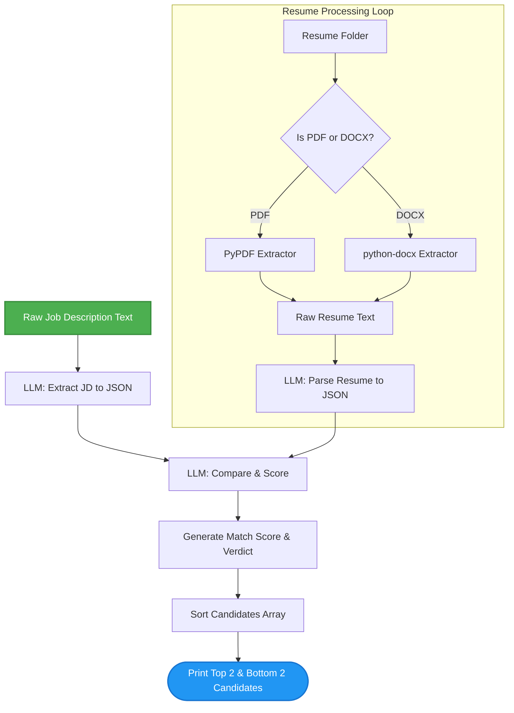

# 🚀 AI-Powered Resume Analyzer & Scorer
An automated, LLM-driven recruitment tool that extracts structured data from Job Descriptions (JDs) and candidate resumes to calculate a definitive matching score. Built with Python and the Groq API, this project demonstrates advanced prompting techniques, JSON schema enforcement using Pydantic, and automated document parsing.

## ✨ Features

* **Intelligent Document Parsing:** Extracts text from both `.pdf` and `.docx` files seamlessly.
* **Structured Data Extraction:** Forces the LLM to return strictly formatted JSON using `Pydantic` schemas, preventing hallucinations.
* **Automated Scoring:** Evaluates candidate skills, experience, and education against the JD to calculate a 0-100% match score.
* **Rate-Limit Safe:** Implements deliberate pauses (`time.sleep`) to prevent API throttling during batch processing.
* **Ranked Outputs:** Automatically sorts the applicant pool and highlights the top-tier and bottom-tier candidates with detailed verdicts.
## 🔄 System Architecture

Here is the high-level flow of how the application processes data:


## 🛠️ Tech Stack

* **Language:** Python 3.11+
* **Package Manager:** `uv`
* **AI API:** Groq (`openai/gpt-oss-120b`)
* **Libraries:**
* `pydantic` (Schema validation)
* `pypdf` (PDF processing)
* `python-docx` (Word document processing)
* `python-dotenv` (Environment variable management)

## 💻 Installation & Setup

### 1. Clone the Repository

```bash
git clone [https://github.com/vivekrajraghav/resume-analyzer.git](https://github.com/vivekrajraghav/resume-analyzer.git)
cd resume-analyzer

```

### 2. Set Up the Environment

Use `uv` to create a fast virtual environment and install the dependencies:

```bash
uv venv --python 3.11
# Windows: .\.venv\Scripts\activate
# Mac/Linux: source .venv/bin/activate

uv add groq pydantic pypdf python-docx python-dotenv

```

### 3. Configure API Keys

Create a `.env` file in the root directory and add your Groq API key:

```env
GROQ_API_KEY=your_actual_api_key_here

```

*(Note: Ensure your `.env` file is included in your `.gitignore` to prevent leaking your key).*

### 4. Prepare the Data Folder

Create a folder named `resume` in the root directory and place your candidate `.pdf` and `.docx` files inside it.

```text
resume-analyzer/
├── main.py
├── .env
├── .gitignore
└── resume/
    ├── candidate_1.pdf
    ├── candidate_2.docx
    └── candidate_3.pdf

```
## 🚀 Usage

Once your resumes are in the `resume/` folder, simply run the script:

```bash
python main.py

```

### Expected Output

The script will output the processing status of each file, followed by a ranked breakdown of the top 2 and bottom 2 candidates, including their exact match percentage and the LLM's detailed reasoning.

```text
Processing: candidate_1.pdf
Score: 85.0
Processing: candidate_2.docx
Score: 40.0
```
Top 2 Candidate
John Doe - 85.0 %
{'Missing Important skills': ['Hugging Face', 'Docker'], 'Overall match percentage': 85.0, 'Whether experience requirements is met': True, 'A short final verdict': 'Strong candidate with solid PyTorch and ML fundamentals, minor gaps in deployment tools.'}
## 🧠 Code Highlights

* **Pydantic Schemas:** Used to define `JD`, `experience`, `resume`, and `matchresult` classes. `.model_json_schema()` translates these Python classes into robust instructions for the LLM.
* **Dual-Prompting:** The scoring function utilizes two sets of structured JSON (the parsed JD and the parsed resume) injected directly into the LLM prompt to force a highly contextual comparison.
